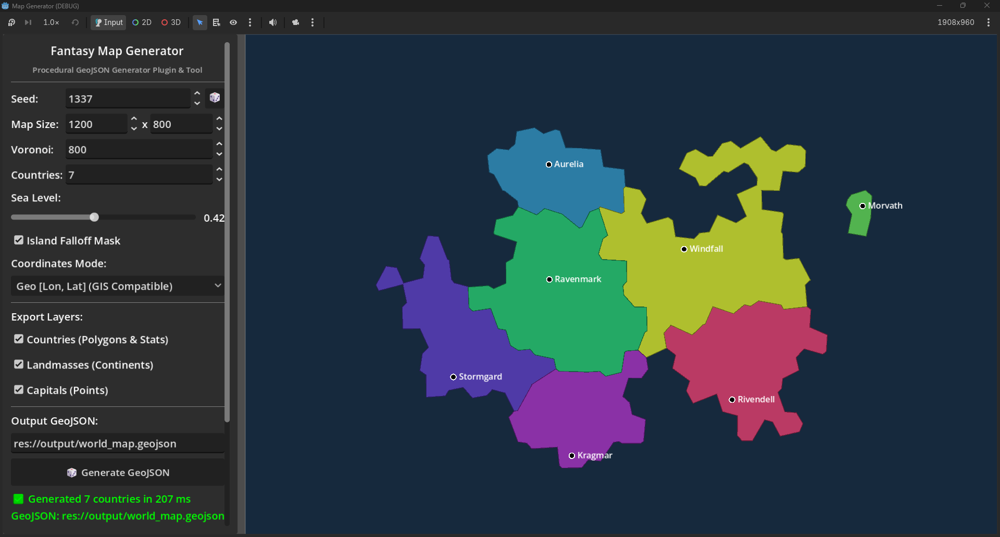

# Fantasy Map Generator for Godot

A lightweight, zero-dependency Godot 4 plugin (compatible with **Godot 4.2+**) and standalone procedural map generator that outputs standard **GeoJSON** (`RFC 7946`). Inspired by [Azgaar's Fantasy Map Generator](https://github.com/Azgaar/Fantasy-Map-Generator), it implements the core procedural generation pipeline directly in Godot using native C++ geometry algorithms.



---

## Features

- **Azgaar-Style Procedural Pipeline**:
  - **Jittered Grid & Voronoi Dual**: Fast Delaunay triangulation (`Geometry2D.triangulate_delaunay`) with Lloyd's relaxation for organic polygonal cells.
  - **Fractal Continents & Islands**: Simplex fractal heightmap with smooth edge-falloff ocean masking.
  - **Inland Seas & Lakes**: Automatically identifies enclosed water bodies and renders/exports them as distinct water features.
  - **Dijkstra Territory Expansion**: Nations / states grow from fertile capital centers across land cells based on distance and elevation cost.
  - **Polygon Dissolving**: Uses Godot's built-in Clipper C++ engine (`Geometry2D.merge_polygons`) to merge individual cells into clean outer boundary country and continent polygons (no gaps or overlaps).
  - **Simulation Attributes**: Generates country stats for *The Chancellor* (`military`, `wealth`, `technology`, `quality_of_life`, `hospitality`, and shared border `neighbors`).
- **GeoJSON Export (`RFC 7946`)**:
  - `country` features: `Polygon` / `MultiPolygon` with names, colors, stats, and neighbors.
  - `land` features: `Polygon` / `MultiPolygon` for continents and islands.
  - `lake` features: `Polygon` / `MultiPolygon` for inland lakes and enclosed seas.
  - `capital` features: `Point` markers with coordinates.
  - Coordinate system options: **Geo [Lon, Lat]** (GIS/QGIS compatible), **Pixel [X, Y]** (Godot 2D canvas), or **Normalized [0.0 - 1.0]**.
- **Ways to Run**:
  1. **Runtime API**: Call directly in 1 line of GDScript or C# at runtime!
  2. **Editor Plugin**: A dedicated dock panel in the Godot Editor.
  3. **Standalone Visualizer**: Launch the project (`F5`) to pan/zoom, hover over countries to view stats, tweak sliders, and export.
  4. **Headless CLI**: Run from terminal / build scripts with command-line arguments.

---

## Runtime API (GDScript & C#)

You can generate maps and GeoJSON dynamically during gameplay or procedural world setup.

### GDScript Example
```gdscript
# 1. One-line: Generate GeoJSON file to disk
var err: Error = MapGenerator.generate_geojson_file("res://Assets/Data/world.geojson", {
    "seed": 1337,
    "num_countries": 8,
    "sea_level": 0.42
})

# 2. One-line: Generate countries-only GeoJSON (ideal for games)
var err2: Error = MapGenerator.generate_countries_only_file("res://Assets/Data/territories.geojson", {
    "custom_names": ["Valoria", "Oakhaven", "Ravenmark"]
})

# 3. One-line: Get GeoJSON as a string
var geojson_str: String = MapGenerator.generate_geojson_string({ "num_countries": 6 })

# 4. Get in-memory map data dictionary
var data: Dictionary = MapGenerator.generate({ "seed": 42, "num_countries": 5 })
for country in data["countries"]:
    print(country["name"], " Capital: ", country["capital_name"], " (", country["capital_pos"], ") Neighbors: ", country["neighbors"])
```

### C# Example
```csharp
using Godot;

public partial class WorldLoader : Node
{
    public override void _Ready()
    {
        var mapGen = GD.Load<GDScript>("res://addons/map_generator/map_generator.gd");
        
        var parameters = new Godot.Collections.Dictionary
        {
            { "seed", 1337 },
            { "num_countries", 6 }
        };

        // Call one-line generator
        var err = (Error)mapGen.Call("generate_geojson_file", "res://Assets/Data/world.geojson", parameters);
        GD.Print($"Map generated with result: {err}");
    }
}
```

---

## Getting Started with the Tools

### 1. Standalone Visualizer
Open the `map_generator` folder in Godot 4.x and run the project (`F5`):
- **Pan & Zoom**: Scroll wheel to zoom, middle click or left-click drag to pan.
- **Hover**: Move mouse over any territory to view its stats, diplomacy/hospitality, and borders.
- **Generate**: Tweak seed, country count, or sea level, then click **Generate GeoJSON**.

### 2. Using as Godot Editor Plugin
1. Copy `addons/map_generator` into `res://addons/map_generator` in your game project.
2. Go to **Project Settings -> Plugins** and enable **Map Generator**.
3. A **Fantasy Map Generator** dock will appear in your editor panels.
4. Set parameters and click **🎲 Generate GeoJSON**.

### 3. Headless CLI Execution
Run the CLI runner from your terminal:
```bash
# Linux / macOS / Bash:
godot --headless -s addons/map_generator/cli_runner.gd -- --seed 12345 --countries 8 --out "res://output/world.geojson"

# Windows PowerShell:
godot --headless -s addons/map_generator/cli_runner.gd "--" --seed 12345 --countries 8 --out "res://output/world.geojson"
```

#### CLI Options
- `--seed <int>`: Random seed (default: random).
- `--countries <int>`: Number of nations/states (default: 7).
- `--cells <int>`: Number of Voronoi cells (default: 800).
- `--width <float>`: Map canvas width in pixels (default: 1200).
- `--height <float>`: Map canvas height in pixels (default: 800).
- `--size <W>x<H>`: Shorthand to specify both dimensions (e.g. `1920x1080`).
- `--sea`, `--sea-level <float>`: Sea level threshold between 0.15 and 0.75 (default: 0.42).
- `--island-mask <bool>` / `--no-island-mask`: Radial edge-falloff ocean mask for continents/islands (default: true).
- `--no-countries`: Omit country territory polygons.
- `--no-land`: Omit continent/island background polygon.
- `--no-capitals`: Omit separate capital city Point features.
- `--no-lakes`: Omit inland lake and enclosed sea polygons.
- `--custom-names <list|path>`: Comma-separated list or file path of realm names to use (e.g. `CountryNames.csv`).
- `--mode <geo|pixel|normalized>`: Coordinate projection system (default: geo).
- `--out <path>`: Target file path (default: `res://output/world_map.geojson`).
- `--help` / `-h`: Display command-line options and exit.

---

## GeoJSON Structure

The exported `.geojson` file follows the GeoJSON `FeatureCollection` specification:

```json
{
  "type": "FeatureCollection",
  "features": [
    {
      "type": "Feature",
      "id": 1,
      "geometry": {
        "type": "Polygon",
        "coordinates": [
          [ [-45.2, 28.5], [-40.1, 32.4], ..., [-45.2, 28.5] ]
        ]
      },
      "properties": {
        "id": 1,
        "name": "Valoria",
        "type": "country",
        "color": "#3b82f6",
        "capital": "Valoria City",
        "capital_coords": [-42.5, 30.1],
        "label_x": -42.5,
        "label_y": 30.1,
        "area": 95400.0,
        "cells_count": 62,
        "military": 78,
        "wealth": 85,
        "technology": 64,
        "quality_of_life": 72,
        "hospitality": 45,
        "neighbors": [2, 4, 5]
      }
    }
  ]
}
```

---

## Acknowledgements & Credits

This project implements procedural map generation algorithms inspired by:
- **[Azgaar's Fantasy Map Generator](https://github.com/Azgaar/Fantasy-Map-Generator)** by Azgaar (MIT License).

---

## License

This project is licensed under the [Apache License, Version 2.0](LICENSE).
See the [NOTICE](NOTICE) file for third-party acknowledgements.
